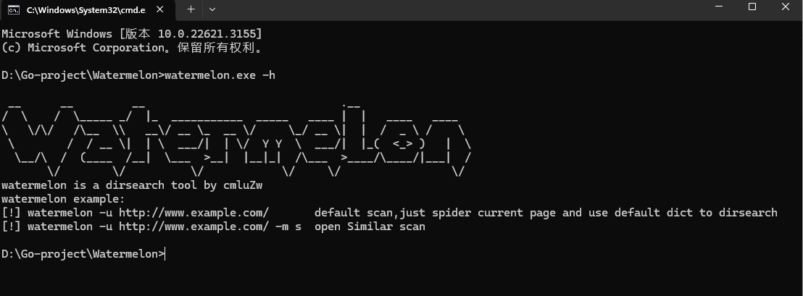
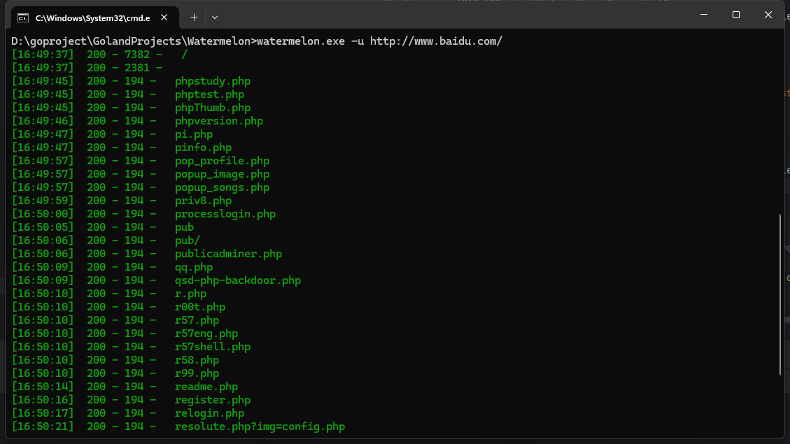
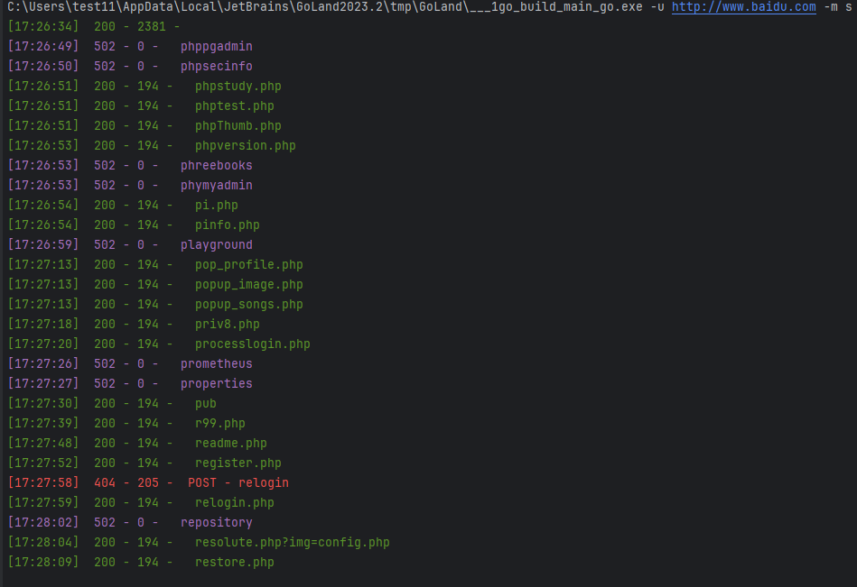

# Watermelon
## 一个go语言开发的dirsearch工具
### 目录结构
- application 参数解析和入口
- common 公共方法
  - bin 
- config 全局配置文件
- dict 字典目录
    - dict.txt 默认字典
    - spider 通过爬取页面自动生成的字典
    - Blaste 爆破产生的字典
- log 日志目录
- scan 扫描目录
- spider 爬虫目录
- watermelon.exe 已经打包好的exe文件

### 编译方法
```cmd
go mod download

go build -o watermelon.exe
```

### 使用方法

```cmd
watermelon.exe -h
watermelon -u http://www.example.com/
watermelon -u http://www.example.com/ -m s  
```
- -h 查看使用方法
- 不指定-m 为默认扫描
- -m s 为相似度判断扫描
### 运行截图
```cmd
watermelon.exe -h
```



```cmd
watermelon.exe -u http://www.baidu.com/
```




```cmd
watermelon.exe -u http://www.baidu.com/ -m s
```
- 相似度可以调低一点可以过滤更多页面,这里的相似度是0.95
- 

